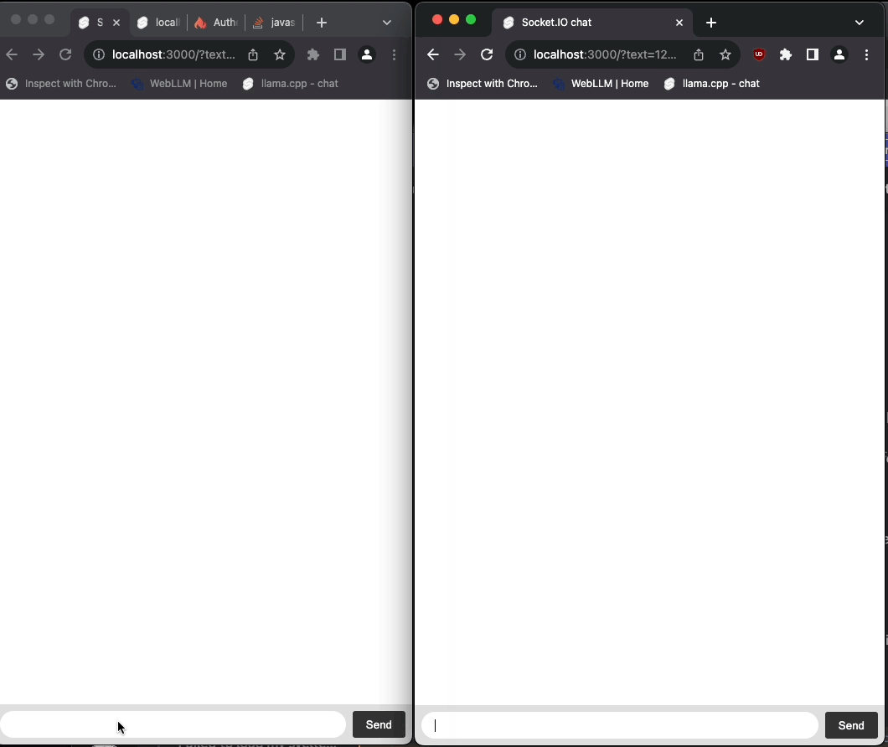

# sveltekit-socket-io-example

A SvelteKit implementation of the [Getting started chat tutorial on the Socket.io website](https://socket.io/get-started/chat) chat.

### Start

```
nvm use
npm i
npm run server
```



## Differences vs Socket.io demo

The difference between this demo and the Socket.io one is that this demo sends messages through SvelteKit Form Actions. This allows you to do things such as validate messages on the server side or reject them altogether before emitting them.


## Drawbacks

Currently the Vite dev server is not implemented, you have to test using production builds.